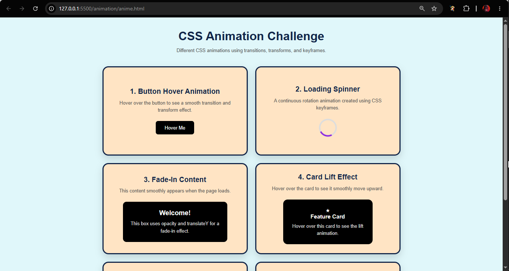
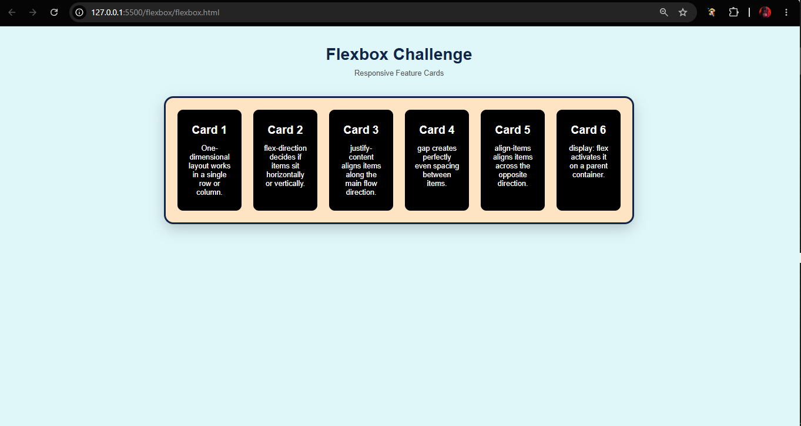
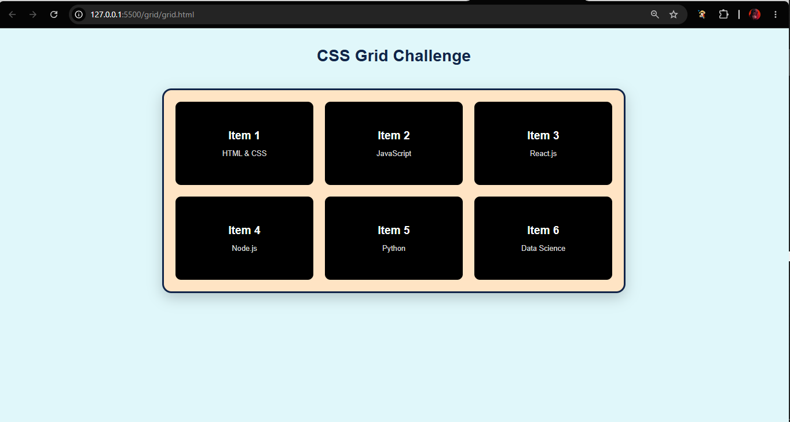
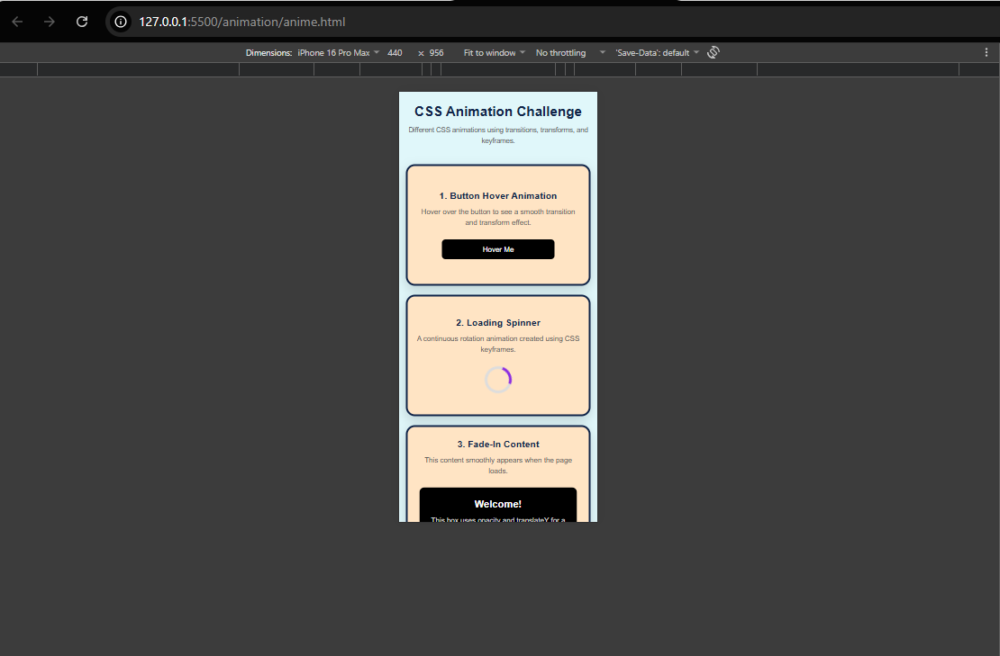
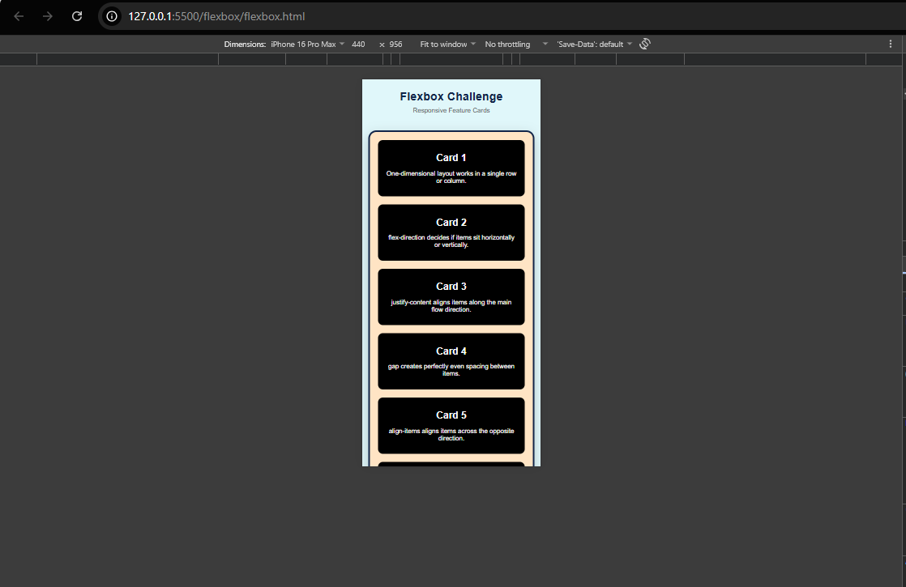
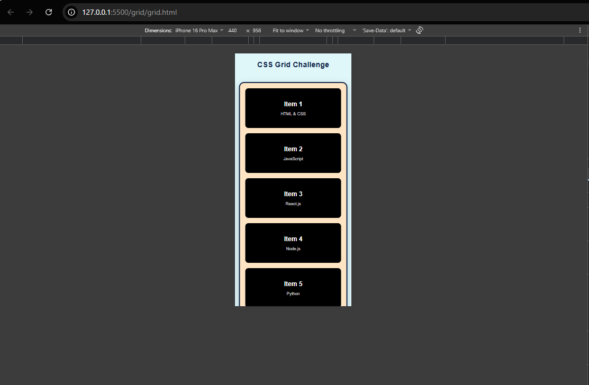

# CSS Layout & Animation Challenge

A responsive CSS mini-project covering **Flexbox, CSS Grid, and CSS Animations**.

## 🚀 Challenges

### 1. Flexbox
- 3 responsive cards
- Horizontal layout on desktop
- Vertical layout on mobile
- Uses `justify-content`, `align-items`, `gap`, and flexible widths
- Hover effects

### 2. CSS Grid
- 6 responsive grid items
- Uses `repeat()` and `gap`
- 3 columns → 2 columns → 1 column
- Consistent card styling and spacing

### 3. CSS Animations
Includes:
- Button hover
- Loading spinner
- Fade-in content
- Card lift effect
- Animated navigation underline
- Pulse animation

## 📱 Responsive Design

The layouts adapt to desktop, tablet, and mobile screen sizes using CSS media queries.

## 🛠️ Technologies

- HTML5
- CSS3
- Flexbox
- CSS Grid
- Transitions
- Transforms
- Keyframes
- Media Queries

## 📂 Project Structure

```text
├── animation
|   ├── anime.html
|   └── anime.css
├── flexbox
|   ├── flexbox.html
|   └── flex.css
├── grid
|   ├── grid.html
|   └── grid.css
├── Screenshot
|
└── README.md
```
## Screenshots

*desktop-view







*mobile-view








👨‍💻 Author
Aadarsh Tripathi
